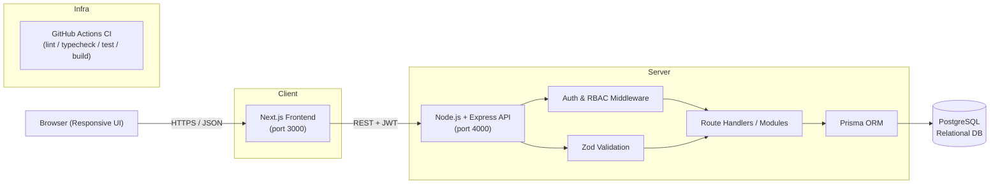

# System Architecture

## Layers

1. **Presentation layer** – Next.js (App Router) with Tailwind CSS. Client components call the REST
   API and store the JWT in `localStorage`. Fully responsive (mobile → desktop).
2. **API layer** – Express server exposing a RESTful API under `/api`:
   - `helmet` for security headers, `cors` for cross-origin control, `express-rate-limit` on login.
   - `requireAuth` + `requireRole` middleware enforce authentication and RBAC.
   - `Zod` validates every request body/params.
3. **Data layer** – Prisma ORM maps entities to PostgreSQL. Migrations are version-controlled under
   `backend/prisma/migrations`.
4. **Infrastructure** – Docker Compose spins up Postgres + backend + frontend. GitHub Actions runs
   linting, type-checking, tests, and a production build on every push/PR.

## Security highlights

- Passwords hashed with **bcrypt** (cost 10); never returned to clients.
- **JWT** (HS256) issued on login, verified on every request; `requireRole` gates admin/PM routes.
- Authorization is **object-level**, not just role-level: Project Managers may only modify projects
  they own; Team Members may only change the status of tasks assigned to them.
- Input validation with **Zod**; Prisma errors mapped to clean HTTP responses (409/404).
