# Use Case Diagram

```mermaid
graph TD
    Admin["Administrator"]
    PM["Project Manager"]
    Member["Team Member"]

    subgraph Admin_UseCases["Administrator"]
        UC1["Manage users (create / edit / deactivate / delete)"]
        UC2["Assign roles (ADMIN / PM / Member)"]
        UC3["View all projects & system overview"]
        UC4["Manage any project (edit / delete)"]
    end

    subgraph PM_UseCases["Project Manager"]
        UC5["Create projects"]
        UC6["Assign team members to projects"]
        UC7["Create / update / delete tasks"]
        UC8["Assign tasks to members"]
        UC9["Update project status & details"]
        UC10["Comment on tasks"]
    end

    subgraph Member_UseCases["Team Member"]
        UC11["View assigned projects"]
        UC12["View assigned tasks"]
        UC13["Update own task progress (status)"]
        UC14["Comment on tasks"]
    end

    Admin --> UC1 & UC2 & UC3 & UC4
    PM --> UC5 & UC6 & UC7 & UC8 & UC9 & UC10
    Member --> UC11 & UC12 & UC13 & UC14

    Auth["Authentication (JWT login)"]
    Admin --> Auth
    PM --> Auth
    Member --> Auth
```

## Actors

| Actor | Primary responsibilities |
| --- | --- |
| **Administrator** | System access control, user & role management, oversight of all projects. |
| **Project Manager** | Project lifecycle, team composition, and task planning/assignment. |
| **Team Member** | Execution: view work assigned to them and report progress. |

## Authentication

All actors authenticate via `POST /api/auth/login` and receive a JWT. The token is sent as a
`Bearer` header on every subsequent request. Role-based access control (RBAC) is enforced on the
server for every protected route.
